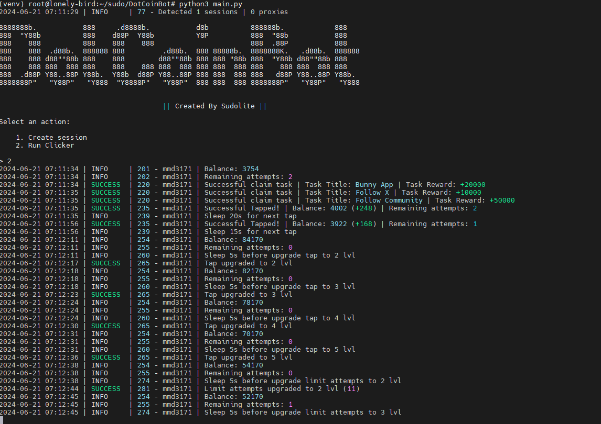

[](https://t.me/SudoLite)



> با تشکر ویژه از [shamhi](https://github.com/shamhi)

## عملکرد
| عملکرد                                                       | پشتیبانی |
|--------------------------------------------------------------|:-------:|
| چندنخی                                                        |    ✅    |
| اتصال یک پروکسی به یک جلسه                                   |    ✅    |
| خرید خودکار آیتم‌ها اگر سکه دارید (کلیک، تلاش‌ها)              |    ✅    |
| دریافت خودکار تمام وظایف اگر ممکن باشد                      |    ✅    |
| زمان خواب تصادفی بین کلیک‌ها                                  |    ✅    |
| تعداد تصادفی کلیک‌ها در هر درخواست                           |    ✅    |
| پشتیبانی از tdata / pyrogram .session / telethon .session     |    ✅    |

## [تنظیمات](https://github.com/SudoLite/DotCoinBot/blob/main/.env-example)
| تنظیم                      | توضیحات                                                                  |
|----------------------------|--------------------------------------------------------------------------|
| **API_ID / API_HASH**      | اطلاعات پلتفرمی که از آن برای راه‌اندازی جلسه تلگرام استفاده می‌شود (پیش‌فرض - اندروید) |
| **AUTO_UPGRADE_TAP**       | آیا باید بهبود ضربه زدن انجام شود _(True / False)_                     |
| **MAX_TAP_LEVEL**          | حداکثر سطح ضربه زدن _(تا ۱۵)_                                            |
| **AUTO_UPGRADE_ATTEMPTS**  | آیا باید بهبود محدودیت تلاش‌ها انجام شود _(True / False)_              |
| **MAX_ATTEMPTS_LEVEL**     | حداکثر سطح محدودیت تلاش‌ها _(تا ۱۵)_                                     |
| **RANDOM_TAPS_COUNT**      | تعداد تصادفی ضربه‌ها _(مثلاً [50,200])_                                  |
| **SLEEP_BETWEEN_TAP**      | تأخیر تصادفی بین ضربه‌ها به ثانیه _(مثلاً [10,25])_                      |
| **USE_PROXY_FROM_FILE**    | آیا از پروکسی موجود در فایل `bot/config/proxies.txt` استفاده شود (True / False) |

## نصب
می‌توانید [**مخزن**](https://github.com/SudoLite/DotCoinBot) را با کلون کردن به سیستم خود دانلود کنید و وابستگی‌های لازم را نصب کنید:
```shell
~ >>> git clone https://github.com/SudoLite/DotCoinBot.git
~ >>> cd DotCoinBot

# اگر از جلسات Telethon استفاده می‌کنید، شاخه "converter" را کلون کنید
~ >>> git clone https://github.com/SudoLite/DotCoinBot.git -b converter
~ >>> cd DotCoinBot

#لینوکس
~/DotCoinBot >>> python3 -m venv venv
~/DotCoinBot >>> source venv/bin/activate
~/DotCoinBot >>> pip3 install -r requirements.txt
~/DotCoinBot >>> cp .env-example .env
~/DotCoinBot >>> nano .env # در اینجا باید API_ID و API_HASH خود را مشخص کنید، بقیه به صورت پیش‌فرض گرفته می‌شود
~/DotCoinBot >>> python3 main.py

#ویندوز
~/DotCoinBot >>> python -m venv venv
~/DotCoinBot >>> venv\Scriptsctivate
~/DotCoinBot >>> pip install -r requirements.txt
~/DotCoinBot >>> copy .env-example .env
~/DotCoinBot >>> # API_ID و API_HASH خود را مشخص کنید، بقیه به صورت پیش‌فرض گرفته می‌شود
~/DotCoinBot >>> python main.py
```

همچنین برای راه‌اندازی سریع می‌توانید از آرگومان‌ها استفاده کنید، به عنوان مثال:
```shell
~/DotCoinBot >>> python3 main.py --action (1/2)
# یا
~/DotCoinBot >>> python3 main.py -a (1/2)

#1 - ایجاد جلسه
#2 - اجرای کلیکر
```
